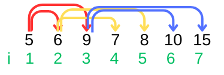
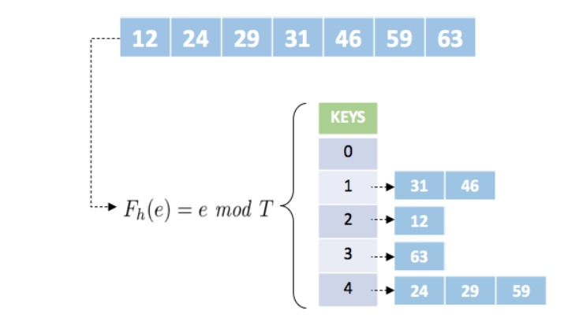
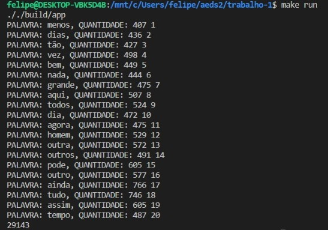

# Top-K-itens

 
 
</a> 

# Problema Proposto
  No problema top k itens, é preciso encontrar os k itens mais valiosos de uma coleção de dados. Logo, utiliza-se o hash para contar a frequência de todos os itens, enquanto o heap se aplica na manutenção de uma lista dos k itens de maior valor.  
  
  -  Criar uma tabela de dispersão (hash) para contar a frequência de cada elemento tokenizado da coleção de dados de entrada.
    
  -  Criar uma árvore de prioridades (heap) de tamanho k e insira os primeiros k elementos do hash nela.  
    -   Para cada elemento restante na hash, comparar a contagem com o menor valor do heap.  
    -   Se a contagem for maior do que o menor valor da heap, remover o menor valor, e inserir o novo elemento e refazer a estrutura. 
    -   Caso contrário, ignorar o elemento e ir para o próximo.
     
No final, a heap conterá os k elementos com maiores valores (frequências) da coleção de dados.

# Arquivos
|  Arquivo                        |   Função                                                                                          |
| ------------------------------- | ------------------------------------------------------------------------------------------------- |
|  `main.cpp`                       | arquivo principal para iniciar e chamar as funções do código                                                    |
|  `read.hpp`                  | define as funções que foram utilizadas no código |
|  `read.cpp`                  | contém o escopo de todas as funções que foram utilizadas |
|  `DomCasmurro.txt`               | arquivo de entrada no qual será feita a análise das palavras |
| `Semana_Machado_Assis.txt` | arquivo de entrada principal no qual será feita a análise das palavras |
| `stopwords.csv` | arquivo que contem as stop words|

## HEAP
  O heap, tem uma sequencia de elementos com chaves, c[1], c[2], ..., c[n], tal que, para que as chaves satisfaçam a condição de funcionamento, a chave de um nó pai deve ser maior que a chave aplicada à seus filhos. Para todo `i`, temos que: 
  -  c[i] ≥ c[2i]  
  -  c[i] ≥ c[2i + 1]  
  
Onde os filhos de `i` sao: 2i e 2i+1. Consequentemente, temps que o pai de `i` e `i` divido por 2. Essa definição deixa a estrutura similar a de uma árvore binária completa.  

O exemplo abaixo mostra, por meio de um vetor, o sistema de pai e filho do heap, demonstrado pelas setas.

  

Observe que o heap apresenta um custo de O(logN), onde N representa o numero de elementos do heap. Uma vez que este se assemelha a uma arvore binária completa, temos a relacao ao numero de nos da arvore, que tambem apresenta custo O(logN) sendo N o numero de nos. O heap apresenta custo O(1), quando houver a necessidade de acessar o elemento que ocupa o topo do vetor.

## HASH
  A tabela hash, tem uma função de transformação, essa e responsavel por receber cada elemento da entrada e gerar uma chave para esse elemento, e armazena-lo em uma dada posição da tabela, que e endereçada pela chave. Formalmente, essa função pode ser representada como h( Kj ) = [1, . . ., M], em que o subconjunto da entrada de tamanho M é mapeada na posição Kj da tabela. Na literatura, há diversas implementações de tal função, sendo algumas dessas o resto da divisão, meio do quadrado, método da dobra, método da multiplicação, hashing universal. Se a escolha de tal função for adequada ao conjunto e houver entradas suficiente para armazenar todos os elementos sem a repetição de chaves, o custo da pesquisa cairá para O(1). O exemplo abaixo utiliza como função o resto da divisão para o conjunto de dados.Para este exemplo, considere a variável T como tamanho da tabela hash e "e" como o elemento a ser indexado.  
  
  

Observe através do exemplo que se a função utilizada for adequada e houver espaço suficiente para armazenar um único elemento por posição a estrutura em hash pode alcançar tempos de O( 1 ), o qual se refere ao melhor tempo de execução / melhor caso. Em um caso médio teremos algo próximo de O( 1+N / T ) e no pior caso O( n ).

## Utilizados

Unordered_map: Mapas não ordenados são contêineres associativos que armazenam elementos formados pela combinação de um valor de chave e um valor mapeado e que permitem a recuperação rápida de elementos individuais com base em suas chaves. Em um unordered_map, o valor da chave geralmente é usado para identificar exclusivamente o elemento, enquanto o valor mapeado é um objeto com o conteúdo associado a essa chave. Os tipos de chave e valor mapeado podem ser diferentes. Internamente, os elementos no unordered_map não são classificados em nenhuma ordem específica em relação a sua chave ou valores mapeados, mas organizados em buckets dependendo de seus valores de hash para permitir acesso rápido a elementos individuais diretamente por seus valores de chave.

Make_heap: Transforma um intervalo de elementos em uma heap. Constrói um heap binário no vetor reordenando os elementos para que eles satisfaçam a restrição de heap. O heap binário é uma árvore binária balanceada que satisfaz a condição de que o valor no nó pai é sempre maior/menor do que os valores dos nós filho. Isso significa que a raiz sempre contém o maior/menor elemento.

Pop_heap(): Remove o elemento de maior prioridade (maior ou menor valor, dependendo da logica do codigo) do topo do heap, e coloca-o na última posição do intervalo do heap. Isso é feito para abrir espaço para inserir um novo valor maior.

# Lógica
Para a resolucao do problema descrito, a funcao `fn_principal()` e responsavel por fazer tudo que e necessario, com o auxilio de outras funcoes. Nela ocorre a criacao das tabela Hash principal, denominada Hash, que sera responsavel por guardar os elementos, a tabela Hash stopWords, que e responsavel por guardar as stopwords, e a tabela Hash pontos, que e responsavel por guardar pontuacoes a serem desconsideradas. Em seguida ocorre a criacao do vector, que sera onde o Heap vai ser realizado.  
Em seguida e chamada a funcao `readStopWords()`, nela ocorre a leitura do arquivo stopwords e as palavras sao guardadas na hash de stopwords.  
A leitura dos arquivos, que detem os textos para que as palavras sejam analizadas e feita na funcao `leitor_principal()`, nela, enquanto nao chegar ao fim do arquivo, o programa pega linha por linha, passa os caracteres para minusculo, em seguida chama a funcao `converterAcentuadasParaMinusculas()`, que converte os caracteres acentuados para minusculo, e a funcao `removePontuacao()`, essa, procura na hash de pontos por meio do `find()`, pontuacoes indesejadas, e faz a remocao delas na linha.  
Ocorre a tokenizacao da linha, para que seja possivel separar palavra por palavra. Apos, ocorre a verificacao se a palavra e StopWord por meio da funcao `count()` esta conta quantas vezes a palavra apareceu, no caso, se a palavra denominada stopWord nao apareceu nenhuma vez, significa que a palavra e valida e sera analisada.  
Verifica se existe numeros nessa palavra, uma vez que uma palavra e feita apenas de letras. Caso nao exista numeros ocorre a insercao na Hash.
A insercao na hash e feita atraves de uma condicao, utilizando a funcao `find()` e `end()` que percorre toda a Hash, verifica se a palavra a ser inserida ja existe, se a palavra existir, e somado 1 a sua quantidade, do contrario a palavra e inserida na Hash.
Sendo assim, a partir da funcao `leitor_principal()`, chamada na funcao `fn_principal()` ocorre a leitura dos arquivos desejados.  
Em seguida, inicializa-se a vector com 20 elementos da Hash, e e feito o processo do Heap, por meio da funcao `make_heap()`. Apos isso, com o vector ja inicializado, ocorre a leitura dos restantes elementos que estao na Hash. Se o valor da Hash, for maior que o primeiro elemento do vector, este primeiro elemento do vector, que apresenta o menor valor entre os demais e removido, utilizando as funcoes `pop_heap()` e `pop_back()`, e o elemento maior vindo da Hash e adionado ao vector, em seguida a funcao `make_heap()` e novamente chamada para realizar o Heap novamente apos a insercao do novo valor.
Assim, o programa descrito realiza as acoes necessarias para solucionar o problema descrito.
 # Resultados 
   Considerando a lógica e a descrição do problema acima, o resultado esperado durante a leitura dos arquivos:
   
  

# Conclusao
  Por meio do projeto e possivel compreender melhor o funcionamento da Hash e do Heap, sendo estruturas fundamentais, que podem ser utilizadas para resolver diversos problemas.
 # Bibliotecas 

Para o funcionamento do programa, é necessário incluir as seguintes bibliotecas: 
<ul>
    <li><code>#include 'bits/stdc++.h'</code></li>
    <li><code>#include 'algorithm'</code></li>
    <li><code>#include 'vector'</code></li>
    <li><code>#include 'cctype'</code></li>
    <li><code>#include 'iomanip'</code></li>
    <li><code>#include 'iostream'</code></li>
</ul>

# Compilação e Execução

Esse pequeno exemplo possui um arquivo Makefile que realiza todo o procedimento de compilação e execução. Para tanto, temos as seguintes diretrizes de execução:

| Comando                |  Função                                                                                           |                     
| -----------------------| ------------------------------------------------------------------------------------------------- |
|  `make clean`          | Apaga a última compilação realizada contida na pasta build                                        |
|  `make`                | Executa a compilação do programa utilizando o g++, e o resultado vai para a pasta build           |
|  `make run`            | Executa o programa da pasta build após a realização da compilação                                 |

# Contatos

 

